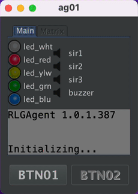

RLG Agent
=========

* [Preface](#preface)
* [Hard- and Software](#hard--and-software)
* [Workspace](#workspace)
    * [Logfiles](#logfiles)
    * [Configs](#configs)
* [Messaging](#messaging)
* [Commands](#commands)
    * [Signals](#signals)
        * [Schemes](#schemes)
        * [Standard signal schemes](#standard-signal-schemes)
        * [Devices](#devices)
    * [Paged Displays](#paged-displays)
        * [Setting the page content](#setting-the-page-content)
        * [Variables and template expressions](#variables-and-template-expressions)
            * [Preset variables](#preset-variables)
            * [Dynamic variables](#dynamic-variables)
            * [Timers](#timers)
* [Events](#events)
    * [Buttons](#buttons)
    * [Status](#status)

---
# Preface
The purpose of the **RLGS** (Real Life Gaming System) is to realize games for **tactical sports** like paintball,
airsoft, Nerf or Laser Tag. RLGS adapts well known multiplayer modes from games like Battlefield, Call of Duty, FarCry,
Planetside 2 oder Counterstrike to be played in real life.

The RLGS concept consists of two basic elements: the [commander](https://github.com/tloehr/rlgcommander) and one or more
agents (this project).

Agents can produce optical and acoustical signals and detect events (currently only the press of a button). They do **not know anything** about why they are flashing LEDs, sounding sirens or why somebody presses their buttons. They
completely rely on the commander to tell them what to do. The commander is the only one who keeps track about the game
situation.

The concept of an agent contains the following in- and output devices.

- 5 light signals, colored in "white, red, yelllow, green, blue"
- 3 Sirens
- a buzzer for local player feedback
- 2 Buttons for player interaction
- and a 20x4 Textdisplay

An agent **does not have to be fully equipped** with every device possible. Such an *complete* system, should not be
necessary. Nevertheless, the software understands all signals, even if the addressed device is not connected. In this
case the signal is accepted but ignored.

#Installation
The agent is written in Java and therefor available on nearly any platform. There are ready-made packages for Windows, Mac, Linux and Raspbian. The Raspbian version is only available as a service or demonized version. Linux versions are distributed via a package repository at flashheart.de. Refer to the [download page](https://www.flashheart.de/doku.php/de:downloads#linux) for more information.

# Hard- and Software

Agents are supposed to run on Raspberry Pi computers with several input and output devices connected to them. Like LED
stripes, sirens (switched by relay boards), push buttons, LCDs etc. But it is also possible to run them on a standard
desktop computers (Mac, Windows, Linux). In this case, they start up a Swing GUI to simulate the aforementioned devices
on the screen or via the sound card.



We use the [Pi4J](https://pi4j.com/) framework to connect the hardware to our Java source code. The whole framework is
about to change drastically with the version 2. But for now we stick to Version 1, which still relies on the now
deprecated [WiringPi](http://wiringpi.com/) project, as it runs very well. Please note, that the Pin numbering used in
the config files are named according to the WiringPi scheme.

WiringPi is not available in Raspbian anymore or as sourcecode in https://git.drogon.net/?p=wiringPi;a=summary
Until we are moving on to pi4j 2.0 (which based on pigpio), we stick with a source code mirror for WiringPi on GitHub.
Which works very well for us.

There is also a standard PCB which works best for a Raspberry Pi setup. You can get Your
own [PCBs here](https://easyeda.com/tloehr/rlg-mainboard-v11_copy).

# Workspace

The agent creates a workspace folder (if missing). The folder's location **has to be specified via a -D argument** on
the java command line.

`java -jar -Dworkspace=/home/pi/rlgagent`

The standard installation packages contain this setting in the `rlgagent.vmoptions` file located in the installation
folder.

- Linux: `/opt/rlgagent` or `/opt/rlagentd`. The latter for an installation as a service or deamon.
- Mac: `/Applications/rlgagent`

This folder contains the **config.txt**  file, the log file directory and the mqtt persistence folder. It usually looks
like this:

```
rlgagent
|--rlgagent-385d8f4a-a0b7-496a-b3ca-7fe0f1cf20a0-tcplocalhost1883
| |--.lck
|--config.txt
|--logs
| |--2022-03-08.rlgagent.log.gz
| |--2022-03-11.rlgagent.log.gz
| |--2022-03-07.rlgagent.log.gz
| |--2022-03-01.rlgagent.log.gz
| |--2022-03-09.rlgagent.log.gz
| |--2022-01-20.rlgagent.log.gz
| |--2022-02-11.rlgagent.log.gz
| |--rlgagent.log
```

## Logfiles

Logfiles are stored in the **logs** subdirectory. The agent archives a log file from a previous day on startup (see
above). The current day's file is always named `rlgagent.log`

## Configs

The **config.txt** is a standard Java properties file. If it is missing either single entries or completely, it will be
created and filled up with the following default settings:

```properties
#Settings rlgagent
#Sun Mar 13 20:19:11 CET 2022
btn01=GPIO 3
btn02=GPIO 4
buzzer=GPIO 26
lcd_cols=20
lcd_i2c_address=0x27
lcd_rows=4
led_blu=GPIO 22
led_grn=GPIO 21
led_red=GPIO 1
led_wht=GPIO 2
led_ylw=GPIO 5
loglevel=DEBUG
mcp23017_i2c_address=0x20
mqtt_broker=localhost
mqtt_clean_session=true
mqtt_max_inflight=1000
mqtt_port=1883
mqtt_qos=2
mqtt_reconnect=true
mqtt_retained=true
mqtt_root=rlg
mqtt_timeout=10
myid=ag01
sir1=GPIO 7
sir2=GPIO 0
sir3=GPIO 6
uuid=d0cc8d4e-7a10-4762-8241-cfa79a932653
wifi_cmd=iwconfig wlan0
```

- `loglevel` the verbosity of the log file. possible values: **OFF, DEBUG, TRACE, INFO, ERROR, WARN**
- `uuid` a unique id which is used as part of the client id to connect to the MQTT broker. Will be created on startup,
  if missing. To get a new uuid on next startup, simply delete this line. **NEEDS TO BE UNIQUE WITHIN THE RLGS SETUP**
- `myid` the agent name to be used. The default is **ag01**. **NEEDS TO BE UNIQUE WITHIN THE RLGS SETUP**
- `led_wht, led_red, led_ylw, led_grn, led_blu, sir1, sir2, sir3, btn01, btn02, buzzer` the Raspi GPIO pin for the
  corresponding devices (Wiring Pi numbering scheme). Default sets the assignment to the standard
  agent [PCB](https://easyeda.com/tloehr/rlg-mainboard-v11_copy).
- `lcd_cols, lcd_rows` dimensions for the LCD.
- `lcd_i2c_address` address on the i2c bus for the connected LCD
- `mcp23017_i2c_address` if a MCP23017 port extender is used, this is the address to find it on the i2c bus
- `mqtt_broker` Space separated list of brokers. The agent tries to connect to the entries in this list - one by one. If
  the connection breaks during the game, the agent keeps trying to reconnect again.
- `mqtt_clean_session` settings for paho client
    - [see here](https://www.eclipse.org/paho/files/javadoc/org/eclipse/paho/client/mqttv3/MqttConnectOptions.html#setCleanSession-boolean-)
- `mqtt_clean_session` settings for paho client
    - [see here](https://www.eclipse.org/paho/files/javadoc/org/eclipse/paho/client/mqttv3/MqttConnectOptions.html#setCleanSession-boolean-)
- `mqtt_port` port address for the broker
- `mqtt_qos` [quality of service](https://en.wikipedia.org/wiki/MQTT#Quality_of_service) to be used for the event
  messages sent by this agent from 0 to 2. Where 0 is at most once, 1 at least once, 2 exactly once.
- `mqtt_max_inflight` the maximum number of messages in transit and not yet delivered.
- `mqtt_reconnect` settings for paho client
    - [see here](https://www.eclipse.org/paho/files/javadoc/org/eclipse/paho/client/mqttv3/MqttConnectOptions.html#setAutomaticReconnect-boolean-)
- `mqtt_retained` sets whether the event messages from this agent should
  be [retained](https://www.hivemq.com/blog/mqtt-essentials-part-8-retained-messages/).
- `mqtt_root` the root element of the message topics to subscribe and send to. Keep the defaults.
- `mqtt_timeout` settings for paho client - [see here](settings for paho client
    - [see here](https://www.eclipse.org/paho/files/javadoc/org/eclipse/paho/client/mqttv3/MqttConnectOptions.html#setConnectionTimeout-int-)
- `wifi_cmd` only for Raspberry Pis. command line to be execute every 5 seconds. The results are parsed and sent to the
  commander via a status event message.

# Messaging

The commander and the agents communicate via a [MQTT](https://en.wikipedia.org/wiki/MQTT) broker.

Every agent has its own command and event channel.

- **inbound command channel:** `/<mqtt_root>/cmd/<agent_id>/#` will provide orders from the commander to the agent
- **outbound event channel:** `/<mqtt_root>/evt/<agent_id>/#` will be used to send information about what happened to
  the agent. Like button presses or network connectivity.

Where

- `mqtt_root`
- `agent_id`

are both defined in **configs.txt**

**EXAMPLE:** for a default installation these two channels are

- **inbound command channel:** `/rlg/cmd/ag01`. Commands (sub-channels) can be: **signals, paged, timers, vars**.
  Example: a command to switch off all LEDs would be sent to `/rlg/cmd/ag01/signals` with this JSON
  payload `{"led_all":"off"}`
- **outbound event channel:** `/rlg/evt/ag01`. Events (sub-channels) can be: **btn01, btn02, state**.

# Commands

Every command is sent to its own sub-topic below the agent's command channel. Signals to ag01 are sent
to `/rlg/cmd/ag01/signals`, LCD content to `/rlg/cmd/ag01/paged` etc. The examples below are written with these default
settings in mind.

## Signals

Topic: `/rlg/cmd/ag01/signals`

Signals are sent out by the agent optically (LEDs) or accoustically (Sirens, Buzzer).

### Schemes

Signal schemes are lists of **on** and **off** durations (in milliseconds) for the specific Raspi pin. Every list is
preceded by the number of repeats. If a scheme should go on forever (until overwritten by a new command), the
repeat_count can be replaced by the **infty** keyword (in fact, there is no infinity, it is **Long.MAX_VALUE**, but for our
purpose this would take forever). A repeat_count of 0, turns off the signal. Like so: `0:` or the word `off` (which is
also understood).

The syntax of the scheme is:

`<repeat_count>:[on|off],<period_in_ms>;[on|off],<period_in_ms>`

Devices (like LEDs or sirens) connected to these pins via a MOSFET transistors or Relays are switched on and off
accordingly.

### Standard signal schemes

By default, an agent recognizes some standard schemes which are translated locally. In fact, the commander makes
extensive use of these "macros", as they cover most of its needs.

- Singles
    - **very_long**  → `1:on,5000;off,1`
    - **long**  → `1:on,2500;off,1`
    - **medium** → `1:on,1000;off,1`
    - **short** → `1:on,500;off,1`
    - **very_short** → `1:on,250;off,1`
- Recurring
    - **very_slow** → `infty:on,1000;off,5000`
    - **slow** → `infty:on,1000;off,2000`
    - **normal** → `infty:on,1000;off,1000`
    - **fast** → `infty:on,500;off,500`
    - **very_fast** → `infty:on,250;off,250`
    - **netstatus** → `infty:on,250;off,750`
- Buzzer signals
    - **single_buzz** → `1:on,75;off,75`
    - **double_buzz** → `2:on,75;off,75`
    - **triple_buzz** → `3:on,75;off,75`

Hence, a signal with a payload like `{"led_red":"slow"}` would translate to `{"led_red":"infty:on,1000;off,2000"}`.

### Devices

The agent abstracts devices from their GPIO counterparts on the Raspi. The following devices are
recognized: `led_wht, led_red, led_ylw, led_grn, led_blu, sir1, sir2, sir3, btn01, btn02, buzzer`. "sir" stands for
siren. So the meaning of this list should be pretty obvious.

There are 3 device groups:

- `all` → All pins.
- `led_all` → `led_wht, led_red, led_ylw, led_grn, led_blu`
- `sir_all` → `sir1, sir2, sir3`

**Example:**

A signal which causes the agent to buzz two times (75 ms) would have a payload like this:

```json
{"buzzer":"2:on,75;off,75"}
```

If we want all LEDs to blink every second (until further notice), we would send this:

```json
{"led_all":"infty:on,1000;off,1000"}
```

or in short:

```json
{"led_all":"normal"}
```

We can combine multiple payloads into one message. Also for the other commands, not only signals.

```json
{
  "led_all": "infty:on,250;off,2500",
  "sir1": "long"
}
```

## Paged Displays

Topic: `/rlg/cmd/ag01/paged`

Agents can handle LCDs driven by the [Hitachi HD44780](https://en.wikipedia.org/wiki/Hitachi_HD44780_LCD_controller)
controller chip. LCDs with line/col should have a text screen dimension of 20x4. As You can see in
the [JavaDoc for MyLCD](https://github.com/tloehr/rlgagent/blob/main/src/main/java/de/flashheart/rlgagent/hardware/abstraction/MyLCD.java),the
display output is organized in pages, which cycle in order by their addition. Refer to the MyLCD class for more details.

Every screen page is identified by a string handle. Please note that there is always a starting page called **`page0`**,
which cannot be removed.

### Setting the page content

The following payload will set the content of 2 pages. A new page will be created automatically when needed. It is also
automatically removed, when this new page is missing from a later page content command.

```json
{
  "page1": [
    "   >>> BLUE  <<<   ",
    "${blue_l1}",
    "${blue_l2}",
    "Red->${red_tickets}:${blue_tickets}<-Blue"
  ],
  "page0": [
    "   >>> RED   <<<   ",
    "${red_l1}",
    "${red_l2}",
    "Red->${red_tickets}:${blue_tickets}<-Blue"
  ]
}
```

Content exceeding the supported display dimension (e.g. 20x4) will be ignored. Superfluous lines are discarded,
exceeding lines are truncated.

As You can see, we used template expressions in the last example like "${blue_l1}". These expressions refer to a
variable [(see the next section)](#variables-and-template-expressions) and will be replaced by the bound variable
content. The variable content is updated every time the page is displayed.

There also timer variables which are always counted down, even when the page is currently displayed. So You can display
a running timer, even when there is only one page to be displayed.  [(see timers)](#timers)

### Variables and template expressions

Topic: `/rlg/cmd/ag01/vars`

Template expressions are replaced with their corresponding values. These values can be prefixed by the agent or set
dynamically by the commander. [Timers](#timers) are a special case of values. In the above example we used template
expressions already.

You may have noted, that there are some template expressions in the display string like ${agversion}. You will find some
detailed explanations in the [Displays](#paged-displays) section of this document.

#### Preset variables

- **wifi** → the current Wi-Fi signal strength
- **ssid** → ssid of the Wi-Fi connected to.
- **agversion** → current software version of the agent
- **agbuild** → current software build of the agent
- **agbdate** → current software build-date of the agent

#### Dynamic variables

The commander can set any variable to a specific value to fill out the page templates on the display, as described
above. Example message as generated by the Conquest class.

```json
{
  "red_l2": "",
  "blue_tickets": "250",
  "blue_l1": "",
  "red_l1": "",
  "blue_l2": "",
  "red_tickets": "250"
}
```

#### Timers

Topic: `/rlg/cmd/ag01/timers`

Timers are also variables, but they have to be [Long](https://docs.oracle.com/javase/8/docs/api/java/lang/Long.html)
values. The agent interprets those values as **remaining time in seconds** and starts to count them down after
reception. The timer template is replaced by the time in the format ``hh:ss`` and disappears when the time **reaches
zero**.

```json
{
  "remaining": 61
}
```

The above message will start a timer at 1 minute 1 second. A display line:

```json
{
  "timer": "${remaining}"
}
```

will show up on the LCD as `timer: 01:01` - and counting

# Events

Events are something that happens to or on the agent. They are reported to the commander.

## Buttons

Topic: `/rlg/evt/ag01/btn01` or `/rlg/evt/ag01/btn02`

The use of a button is divided into two separate events:

1. The first one reporting that the button is **pressed down**: `{"button":"down"}`
2. the second one when the button is **released again**: `{"button":"up"}`

## Status

Topic: `/rlg/evt/ag01/status`

Every **60 seconds** an agent reports its current status to the commander. Very important to tell, whether all agents
are working correctly during a match.

```json
{
  "mqtt-broker": "localhost",
  "netmonitor_cycle": 96,
  "wifi": "PERFECT",
  "mqtt_connect_tries": 1,
  "essid": "!DESKTOP!",
  "last_ping": "16.03.22, 15:06:27",
  "link": "--",
  "freq": "--",
  "ping_max": "0.044",
  "bitrate": "--",
  "version": "1.0.1.387",
  "ap": "!DESKTOP!",
  "txpower": "--",
  "ping_success": "ok",
  "powermgt": "--",
  "ping_loss": "0%",
  "ping_min": "0.044",
  "ping_avg": "0.044",
  "signal": "-30",
  "ping_host": "localhost",
  "timestamp": "2022-03-16T15:06:27.107081+01:00[Europe/Berlin]"
}
``` 
