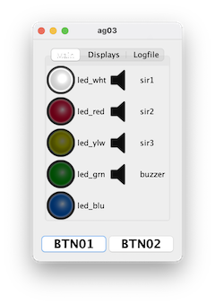
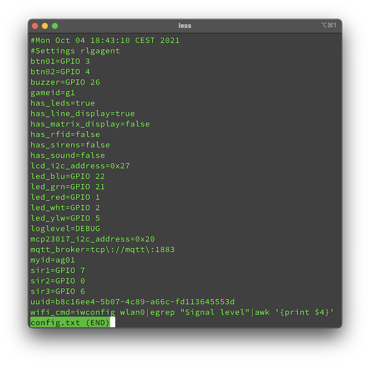

# RLG Agent
This project is part of the RLG (Real Life Gaming) System. Its purpose is to bring known (and hopefully) new game modes to the paintball / airsoft / LARP fields.

Agents do **not know** anything about the current state of a game situation, they completely rely on the command messages sent by the [RLG Commander](https://github.com/tloehr/rlgcommander). The latter keeps track about the states of all the agents during a running game.

They are supposed to run on Raspberry Pi computers with several input and output devices connected to them. Like LED stripes, sirens (switched by relay boards), pushbuttons, LCD Displays etc. But its also possible to run them on a standard desktop computer. In this case, they fire up a Swing GUI to simulate the aforementioned devices on the screen or via the sound card. 



We use the [Pi4J](https://pi4j.com/) toolkit to connect the hardware to our Java source code. The whole framework is about to change drastically with the version 2. But for now we stick to Version 1 which still relies on the deprecated [WiringPi](http://wiringpi.com/) project, as it runs very well. Please note, that the Pin numbering used in the config files are named according to the WiringPi scheme. 
## Configs
The agent creates a workspace folder at startup, IF it is missing. The default location is the **home directory of the particular user**.

The configuration is a standard Java properties file.  



## MQTT
Agents and the Commander communicate through messages handled by [MQTT](https://en.wikipedia.org/wiki/MQTT).

### Topics
Every agent listens to two fixed topics, which are dynamically created like:

1. `<game_id>/cmd/<agent_id>/#`
2. `<game_id>/cmd/all/#`

With 
- `<game_id>` is a unique key for the current game. Every agent and commander must use the same game id to work together.
- `agent_id` Every agent must have a unique id within the running group. Id conflicts are **NOT** detected and must be sorted out by the administrator at setup time, when the agent is first run.

In addition to the two standard topics, a commander can instruct agents to listen to more topics, so it can combine agent to more "logic groups".

### Commands
Commands are MQTT messages received from the commander module. Most of the commands contain parameters as JSON objects stored in the payloads.

#### Signals
Signals are "on/off" schemes for specified pins of the Raspberry Pi. We use a PCB hat, to connect 12V LED Stripes, relay driven 12V sirens and a 12 V buzzers to send out notifications.

Signal schemes are lists of **on** and **off** times (in milliseconds) for the specific raspi pin. Every list is preceded by the number of repeats. If a scheme should go on forever (until changed), the repeat_count can be replaced by the infinity sign ∞ (in fact, there is no infinity, it is Long.MAX_VALUE, but for our purpose this would take forever). A repeat_count of 0, turns off the signal. Like so: "0:" or the word "off" (which is also understood).

The syntax of the scheme is:

```
<repeat_count>:[on|off],<period_in_ms>;[on|off],<period_in_ms>
```

The agent abstracts devices from their GPIO counterparts on the Raspi. The DEVICE-to-GPIO assignment is stored in the config.txt and can be changed, if You use a different connection approach as to use our PCB.

The following devices are recognized:
- buzzer
- led_wht
- led_red
- led_ylw
- led_grn
- led_blu
- sir1
- sir2
- sir3

Two hardcoded device groups can also be addressed.
- led_all - All LEDs
- sir_all - All Sirens (Buzzer not included)

A JSON which turns off the buzzer and then makes it wail two times (75 ms) looks like this:

`{"signal": {buzzer: "off", "2:on,75;off,75"}}`

If we want to let all LEDs blink every second (until further notice), we would send this:

`{"signal": {led_all: "∞:on,1000;off,1000"}}`

We can combine several messages into one combined command to reduce the number of sent messages. Because of the nature of the JSON Objects, only one device can be adressed in every message. But thats enough. I couldn't think of a scenario where we would want to send 2 different pin schemes to the same device. The first scheme would be overwritten immediately. 

Example for "turn all the LEDs off, and sound the buzzer quickly 2 times."
`{"signal": {led_all: "off", buzzer: "2:on,75;off,75"}}`

#### Displays
##### Paged Displays
Agents can handle LCD displays driven by the [Hitachi HD44780](https://en.wikipedia.org/wiki/Hitachi_HD44780_LCD_controller) controller chip. LCDs with line/col dimensions of 16x2 and 20x4 are supported. As You can see in the [JavaDoc for MyLCD](https://github.com/tloehr/rlgagent/blob/main/src/main/java/de/flashheart/rlgagent/hardware/abstraction/MyLCD.java), we organize the display output in pages which cycle in order by their addition. Refer to the MyLCD class for more details.

Example command:
```
{
    "set_page":
        {"handle":"page2", "content":["line1","line2","line3","line4"]}
}
```

Please note that there is always a starting page called "page0". It cannot be removed, and it's first two lines are used by the system. Only the first two lines of the content is used and set to line 3 and 4 for "page0".

`{"set_page": {"handle":"page0", "content":["line3","line4"]}}`

Exceeding content (more lines than actual rows) is ignored. Invalid handles are also ignored.

###### Adding a page
We can add additional pages to the display output. If the page already exists, the command will be ignored.

`{"add_page": "page3"}`

Added pages are removed by the "init" command.

##### Matrix Displays
Matrix displays based on stripes of WS2812 LEDs are planned but not yet implemented.

#### Additional Subscriptions
In order to reduce the amount of messages sent in a short time period, we can order agents to subscribe to additional functional channels, like "sirens", "leds" etc.

`{"subscribe_to": "sirens"}`
`{"subscribe_to": "leds"}`

The name of the groups is not preset. The commander can choose the group names as needed.

#### Initializing an agent
You can (re-)initialize an agent by sendind the `{"init": ""}` command.

The agent will unsubscribe from all additional subscriptions and remove all but one pages from the display. Only "page0" remains with the usual content.

### Events
The agent currently sends 2 different types of events.
1. Notifications about pressed buttons. The agent handles two buttons, but only button 1 is in use. The second button was implemented for later usage. Example: `{"button_pressed":"btn01"}`
2. Status reports about the current state of the agent, to be considered by the commander module. example:
```
{
    "status":{
        "gameid":"g1",
        "has_rfid":false,
        "agentid":"ag01",
        "wifi":3,
        "has_line_display":true,
        "has_sirens":false,
        "has_sound":false,
        "has_leds":true,
        "has_matrix_display":false,
        "timestamp":"2021-10-11T15:30:49.345767+02:00[Europe/Berlin]"
    }
}
``` 
